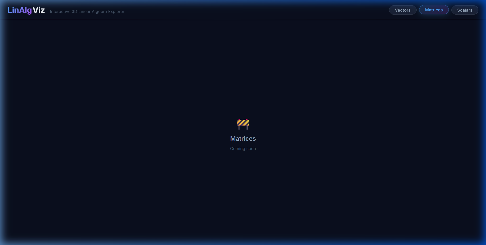

# LinAlgViz 🔷

**An interactive 3D linear algebra explorer built with React, Three.js & React Three Fiber.**

Visualise vectors, operations, and transformations right in your browser — no setup, no equations hidden behind a wall of text. Just drag, spin, and play.

---

## Screenshots

### Vectors Module — 3D scene with multiple vectors


### Vector selected — x/y/z sliders + colour picker


### Live operations panel — dot product, cross product, angle


### Matrices module (coming soon)



---

## Features (Day 2 ✅)

| Feature | Status |
|---|---|
| 3D scene — XYZ axes, infinite grid, fog, orbit controls | ✅ |
| Vector arrows — cylinder shaft + cone tip, auto-colour palette | ✅ |
| Magnitude label per vector (`\|v\| = 3.26`) | ✅ |
| Add / delete / hide vectors | ✅ |
| Rename vectors inline | ✅ |
| x / y / z sliders + number inputs (live update) | ✅ |
| Colour picker per vector | ✅ |
| Selection pulse animation | ✅ |
| Vector operations panel — dot · cross × angle | ✅ |
| Page routing — Vectors / Matrices / Scalars nav | ✅ |
| Matrices module | 🚧 Day 3 |
| Matrix transforms — animate basis vectors | 🚧 Day 3 |
| Click-to-select in 3D (raycasting) | 🚧 Day 3 |

---

## Tech Stack

- **[React 19](https://react.dev/)** + **[Vite 8](https://vitejs.dev/)**
- **[Three.js](https://threejs.org/)** + **[React Three Fiber](https://r3f.docs.pmnd.rs/)**
- **[Drei](https://github.com/pmndrs/drei)** — OrbitControls, Grid, Text helpers
- **[Zustand](https://zustand-demo.pmnd.rs/)** — global state
- Vanilla CSS — design tokens, glassmorphism, custom slider thumbs

---

## Getting started

```bash
git clone https://github.com/VanshAt/3D-Visualizer.git
cd 3D-Visualizer/linalg-viz
npm install
npm run dev
```

Then open **http://localhost:5173/**

---

## Project structure

```
src/
├── lib/
│   └── math.js              # Pure vector math (add, dot, cross, angle …)
├── state/
│   └── useStore.js          # Zustand store — vectors[], selectedId, actions
├── components/
│   ├── Scene/
│   │   ├── SceneSetup.jsx   # Lights, grid, fog, OrbitControls
│   │   ├── Axes.jsx         # XYZ axis lines + labels
│   │   └── VectorArrow.jsx  # 3D arrow (shaft + cone) with labels
│   └── UI/
│       ├── VectorPanel.jsx  # Side panel — cards, sliders, ops
│       └── VectorPanel.css
└── pages/
    └── VectorsPage.jsx      # Canvas + panel layout
```

---

## Roadmap

- **Day 3** — Matrix transforms, 3D click-to-select, animated lerp between states
- **Day 4** — Span visualisation, eigenvalue/eigenvector explorer
- **Day 5** — Polish, keyboard shortcuts, export-to-image

---

*Built day by day 🛠 — follow along as the modules grow.*
