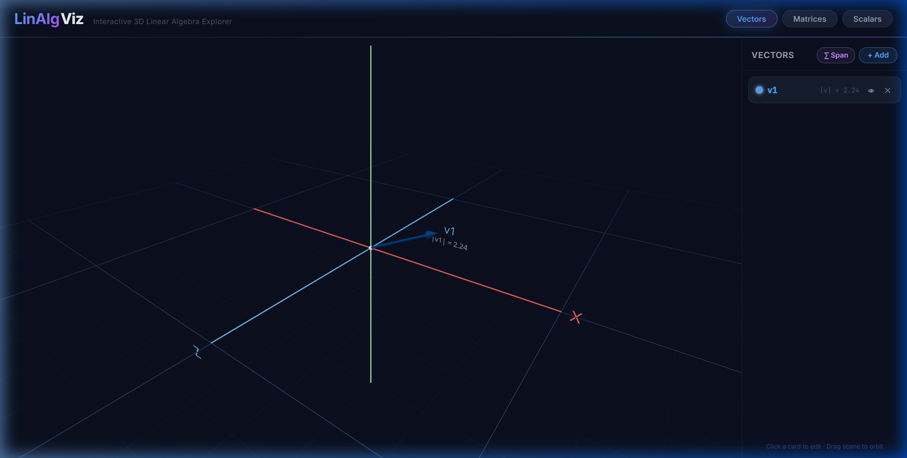
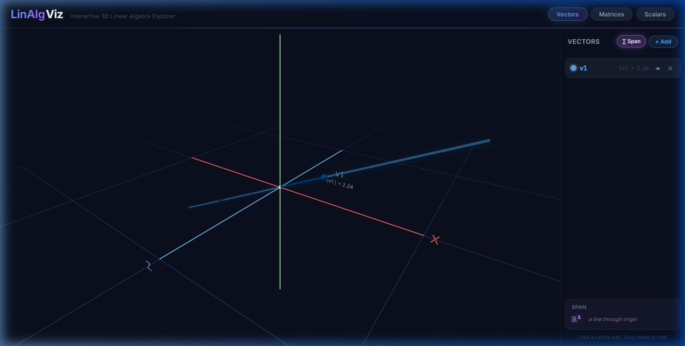
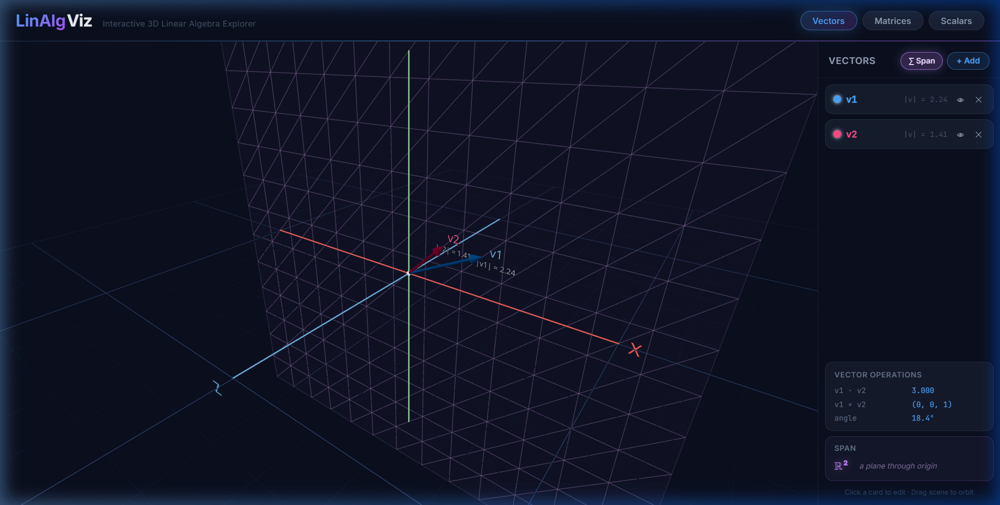
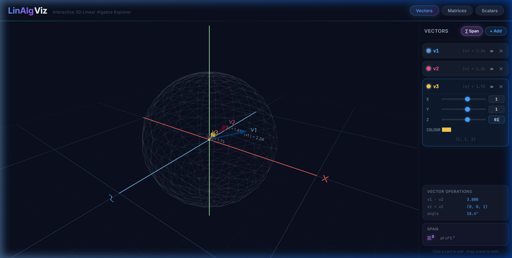
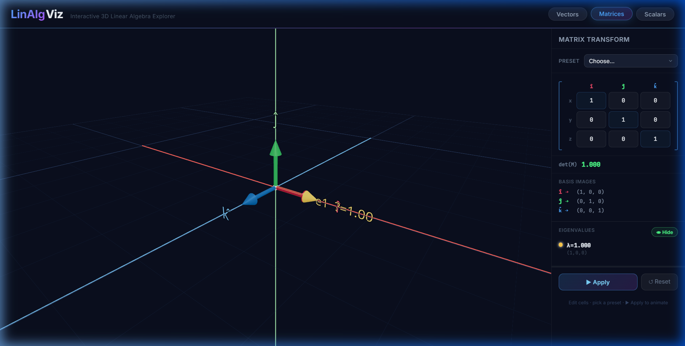
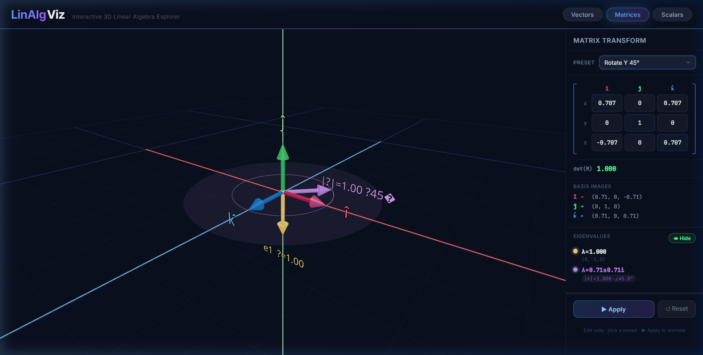
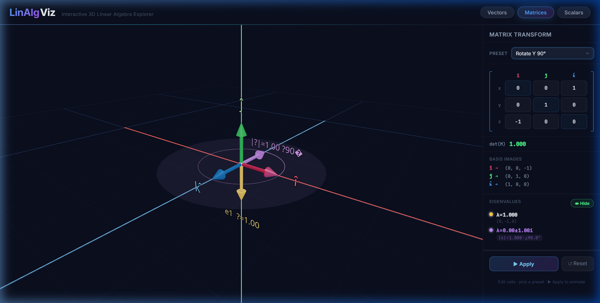
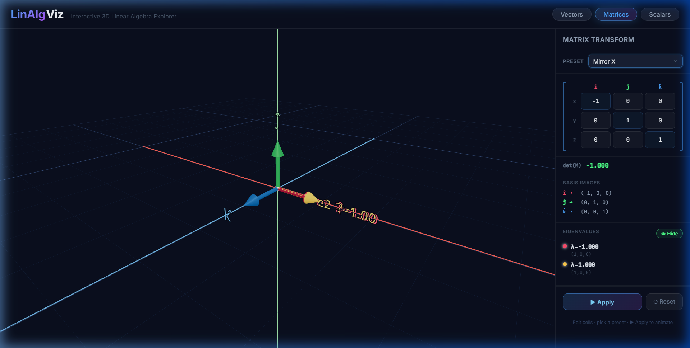
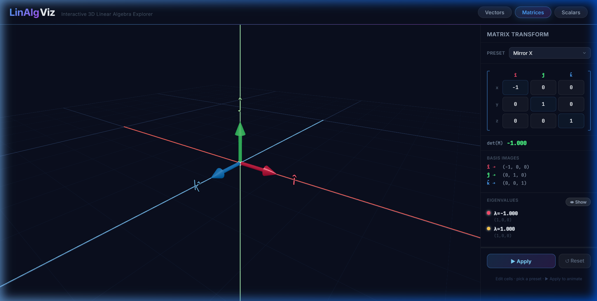

# Day 4 Screenshots — Span Visualisation & Eigenvalue Explorer

## Vectors Page — Span Visualisation

| Screenshot | Description |
|---|---|
|  | Default vectors page |
|  | 1 vector ? span is a **line** through origin (R¹) |
|  | 2 independent vectors ? span is a **plane** (R²) |
|  | 3 independent vectors ? span is **all of R³** (wireframe sphere) |

## Matrices Page — Eigenvalue Explorer

| Screenshot | Description |
|---|---|
|  | Identity matrix — ?=1 (×3), arrows along axes |
|  | Rotation matrix — 1 real (?=1) + complex pair (\|?\|=1, ?45°) with orbit ring & eigenplane disc |
|  | Uniform scaling — all ?=2 (green arrows) |
|  | Reflection — ?=-1 (red) + ?=1 (yellow) |
|  | Panel visible, 3D arrows toggled off |
